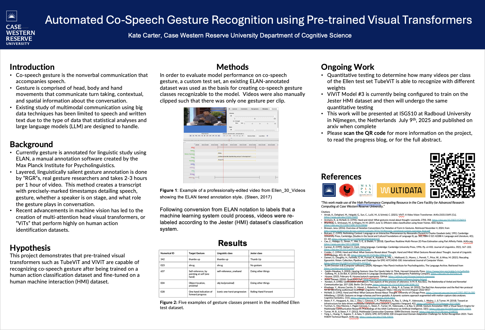

## Intersections Spring 2025
#
April 18th, 2025, Case Western Reserve University.

Poster: *Automated Co-Speech Gesture Recognition using Pre-trained Visual Transformers*

### Abstract

Communication is multimodal, yet most research into human communication has been on spoken or textual language due to the abundance of resources for creating and processing text-based datasets. Other aspects of multimodal communication are understudied due to a lack of tools to create and analyze large datasets of audiovisual data. In the age of data science, new tools for multimodal data analysis have emerged. These will enable advancements in multimodal communications research if properly adapted for linguistic analysis. This project investigates and qualitatively assesses machine learning models for co-speech gesture annotation. Two models, ViViT and TubeViT, have been identified to perform well on video datasets with similar hand focus and granularity as would be required for linguistic gesture analysis. In order to test whether or not they're able to recognize co-speech gesture, a series of videos that were edited in ELAN for co-speech gesture were converted to a format that a visual transformer could process. This test set was then used to assess two visual transformers that had been pre-trained on UCF-101 and then trained on Jester, an HMI dataset.  TubeViT successfully recognized 3 classes of co-speech gesture.  Testing is currently being performed to assess TubeViT's quantitative perfomrance and ViViT's ability to recognize co-speech gesture classes.

